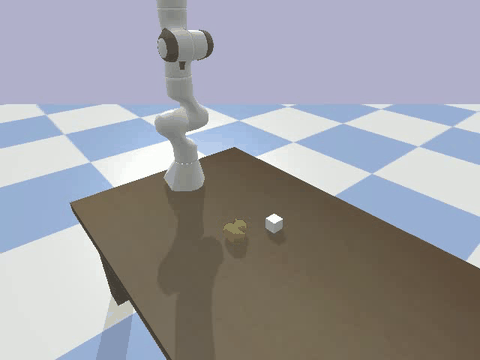
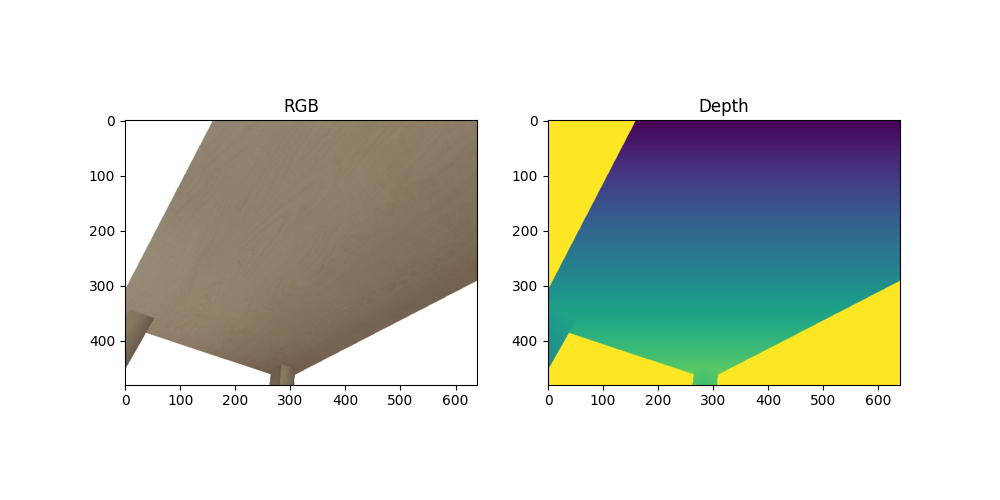
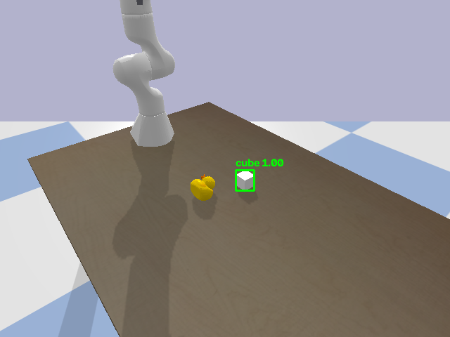

# Perception-to-Grasp 



A simulated robotic pick pipeline in PyBullet. A virtual RGB-D camera looks at a table, the frame is validated, objects are detected, a 3D grasp point is computed from the detection, and a Franka Panda arm attempts the pick.

It connects four stages into one runnable pipeline:

- **RGB-D frame validation** rejects corrupted frames (NaN/Inf depth, zero-size or truncated depth, mostly-empty depth) before they reach planning.
- **Object detection** finds the graspable objects in the camera image.
- **Grasp point computation** converts a 2D detection into a 3D world-frame target using camera projection geometry.
- **Motion execution** drives the simulated Panda arm through hover, descend, grasp and lift using inverse kinematics.

In the recorded demo, the arm moves to a ready pose, hovers over the cube, descends, closes the gripper, and lifts the cube off the table while the duck stays where it is.

There is also a small Gradio dashboard for trying the detector on your own images.

---

## Pipeline

```text
Virtual RGB-D camera
        |
        v
RGB-D validator  --(corrupt frame)--> abort, no motion
        |
        v
Object detection (segmentation mask)
        |
        v
Grasp planner (mask -> 3D top-surface point)
        |
        v
Panda arm: init pose -> hover -> descend -> close -> lift
```

---

## What the demo shows

The recorded run (about 7 seconds) goes through these stages:

1. **Setup:** the Panda stands upright behind a table with a cube and a duck on it, and the camera frame is captured and validated.
2. **Ready pose and approach:** the arm moves to a ready pose and hovers over the cube.
3. **Descend and grasp:** it descends in small steps, and the gripper closes around the cube.
4. **Lift:** the arm lifts slowly, and the cube stays in the gripper through the end of the clip.

The terminal prints the detected boxes, the computed grasp point, the position error of each arm move, and the cube's final position, so you can verify a pick numerically as well as visually.

### Measured result

From the recorded run:

| Check | Result |
|---|---|
| Frame validation | Passed |
| Objects detected | 2 (cube, duck) |
| Estimated cube grasp point | (0.503, 0.097, 0.024) m |
| Cube spawn position (x, y) | (0.500, 0.100) m |
| Grasp point error (x, y) | about 0.5 cm |
| Arm move error (hover, grasp, lift) | 0.9 cm each |
| Cube height after lift | 0.294 m (started at about 0 m on the table) |

The cube's final height matches the lift target (0.304 m) to within about 1 cm, which shows it was carried by the gripper rather than pushed or dropped. This is a single run on fixed object positions.

---

## Screenshots

| RGB + Depth | Detection |
|---|---|
|  |  |

---

## Setup

Tested on Windows with Python 3.10.

```bash
git clone <your-repo-url>
cd perception_to_grasp

python -m venv venv
venv\Scripts\activate          # Windows
# source venv/bin/activate     # macOS / Linux

pip install -r requirements.txt
```

If you don't have a `requirements.txt`, install directly:

```bash
pip install pybullet ultralytics opencv-python gradio numpy pillow imageio moviepy matplotlib
```

---

## Usage

Run all commands from the project root.

**Run the full simulation demo** (opens a PyBullet window):

```bash
python -m src.main_demo
```

**Record the demo to `assets/videos/demo.mp4`:**

```bash
python -m src.record_demo
```

**Convert the recording to a GIF:**

```bash
python src/mp4_to_gif.py
# or with custom paths:
python src/mp4_to_gif.py assets/videos/demo.mp4 assets/videos/demo.gif
```

**Launch the detection dashboard** (Gradio, opens at http://127.0.0.1:7860):

```bash
python app.py
```

**Test the validator:**

```bash
python -m src.test_validator
```

**Test the detection pipeline and save a screenshot:**

```bash
python -m src.test_detection_pipeline
```

---

## How it works

### 1. Scene and camera (`src/scene_setup.py`, `src/camera.py`)
A Franka Panda, a table, a cube and a duck are loaded into PyBullet. The camera returns an RGB image, a depth buffer, a segmentation mask and the view/projection matrices.

### 2. RGB-D validation (`src/rgbd_validator.py`)
Before anything is trusted, each frame is checked for missing data, NaN/Inf depth, zero-size depth arrays, and too few valid depth pixels. `inject_corruption()` can deliberately corrupt a frame to show the validator rejecting it.

### 3. Detection (`src/detect_seg.py`)
In simulation, objects are detected from PyBullet's segmentation mask, which gives an exact bounding box per object. This is used because a COCO-pretrained YOLO model does not reliably recognise simple synthetic shapes like the PyBullet cube and duck. A colour-threshold fallback is available in `src/detect_fallback.py`.

### 4. Grasp point (`src/grasp_planner.py`)
Each pixel of the target's mask is back-projected to world coordinates using the depth buffer and the inverse view-projection matrix. The grasp point is the centre of the object's top surface.

### 5. Execution (`src/execute_grasp.py`)
The arm starts from a ready pose, then moves in small straight-line steps using inverse kinematics with joint limits: hover, descend, close the gripper, then lift slowly.

### 6. Dashboard (`app.py`)
A Gradio app runs a pretrained YOLOv8n detector on any uploaded image and draws boxes and labels. This stage works on real photos, unlike the simulation detector.

---

## Project structure

```text
perception_to_grasp/
├── app.py                      # Gradio detection dashboard
├── requirements.txt
├── src/
│   ├── scene_setup.py          # PyBullet scene (robot, table, objects)
│   ├── camera.py               # RGB, depth and segmentation capture
│   ├── rgbd_validator.py       # frame validation + corruption injection
│   ├── detect.py               # YOLO detector (real images)
│   ├── detect_seg.py           # segmentation-mask detector (simulation)
│   ├── detect_fallback.py      # colour-threshold fallback
│   ├── visualize_detections.py # draw boxes and labels
│   ├── grasp_planner.py        # pixel + depth -> 3D grasp point
│   ├── execute_grasp.py        # IK motion + gripper control
│   ├── main_demo.py            # full pipeline
│   ├── record_demo.py          # record the run to MP4
│   ├── mp4_to_gif.py           # MP4 -> GIF
│   ├── test_validator.py
│   └── test_detection_pipeline.py
└── assets/
    ├── screenshots/
    └── videos/
```

---

## Known limitations

- **Simulation detection uses ground-truth segmentation.** The detector in the PyBullet run reads the simulator's segmentation mask, which is not available on a real robot. A real deployment would need a trained detector or segmenter here.
- **The YOLO dashboard is separate from the simulation.** `app.py` uses COCO-pretrained YOLOv8n on uploaded photos. It does not detect the PyBullet cube or duck reliably.
- **Grasping is basic.** Grasp points come from the centre of the top surface, with a top-down gripper orientation. There is no grasp-quality scoring, collision checking or object-part reasoning.
- **One object, one run.** The demo targets the first detected object (the cube). The duck is detected but not picked, and there is no place step. The successful pick was verified in a recorded run on fixed object positions, so results on other layouts or other objects are untested.
- **Single-shot planning.** The scene is captured once. There is no re-detection during the approach and no recovery if a grasp fails.

## Possible next steps

- Swap in a detector trained on the simulated objects.
- Turn the object-height check after the lift (and the finger opening after closing) into automatic grasp verification with retry.
- Pick the duck as well, and place objects at a target location.
- Add pose-aware grasp orientation instead of a fixed top-down grasp.


